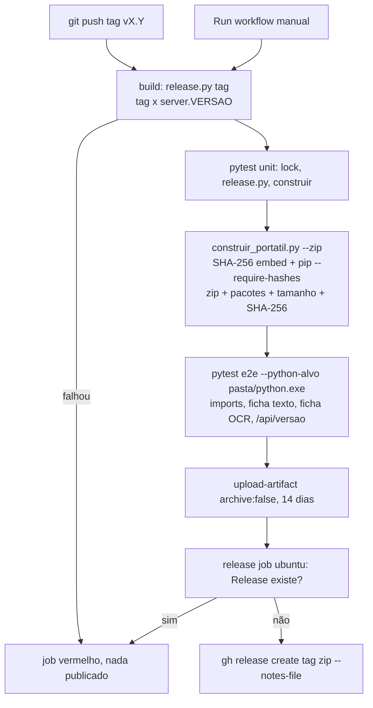

# Build Windows Design

**Spec**: `.specs/features/build-windows/spec.md`
**Status**: Draft

---

## Architecture Overview

Um workflow do GitHub Actions com dois jobs. O job `build` (Windows, `contents: read`) roda o mesmo `construir_portatil.py` de hoje, agora com integridade (SHA-256 do Python embutido + lock com hash), e em seguida roda a suíte `pytest` **com o Python da pasta gerada** como alvo. O zip é gerado no fim do `construir_portatil.py` (antes dos testes, então sai sem resíduo deles), mas só sobe como artefato se os testes passarem. O job `release` (Ubuntu, `contents: write`) baixa esse artefato e cria a Release — nunca sobrescreve uma existente.

A suíte de verificação é a mesma no Mac e no CI: ela recebe o interpretador-alvo por opção (`--python-alvo`). No Mac aponta para o `.venv`; no CI, para `portatil/.../python/python.exe`. O pytest roda no Python do host (só precisa de pytest) e executa o alvo por subprocesso — assim nada de teste entra na pasta distribuída.



### Abordagens consideradas

| Abordagem | Resumo | Veredito |
| --------- | ------ | -------- |
| **A. CI Windows roda `construir_portatil.py` + pytest contra a pasta** | Um script de build só (roda no CI e num Windows local); verificação com o Python real da pasta | **Escolhida** |
| B. Build reescrito em passos YAML/PowerShell | Duplica a lógica do `construir_portatil.py`; não dá para rodar localmente | Descartada |
| C. Instalar dependências num runner Linux com `uv --python-platform`, verificar num Windows | Dois caminhos de instalação e resolução cruzada; economiza ~2 min de build | Descartada: mais peças, mesmo resultado |

---

## Code Reuse Analysis

### Existing Components to Leverage

| Component | Location | How to Use |
| --------- | -------- | ---------- |
| Build da pasta portátil | `construir_portatil.py:78` (`main`) | Mantido; ganha SHA-256, lock com hash, zip e registro |
| Ajuste do `._pth` | `construir_portatil.py:106-117` | Intocado (já validado) |
| Autoteste 6/6 | `construir_portatil.py:155-180` | Mantido para builds locais no Windows; `fitz` → `pymupdf` |
| Versão do app | `server.py:39` (`VERSAO = "1.1"`) | Lida por regex (sem importar Flask) em `release.py` |
| `converter()` | `converter.py:1841` | Chamado pelo alvo nos testes e2e; nada muda |
| `ocr_status()` / `/api/versao` | `converter.py:637`, `server.py:183` | Teste WIN-07 consulta a rota |
| Rodar o server numa porta | `server.py:268-271` (`PORT`) | Teste WIN-07 sobe com `PORT` livre |

### Integration Points

| System | Integration Method |
| ------ | ------------------ |
| python.org | Download do embed zip, conferido por SHA-256 fixo |
| PyPI | `pip install --require-hashes -r requirements-windows.lock` com o Python da pasta |
| GitHub Actions | `.github/workflows/windows.yml`; artefato entre jobs |
| GitHub Releases | `gh release create` no job `release` com `GITHUB_TOKEN` |

---

## Components

### `requirements-windows.lock` (novo)

- **Purpose**: Versões exatas + hashes de todas as dependências da pasta, para win_amd64/cp312.
- **Location**: raiz do repo.
- **Interfaces**: gerado por `uv pip compile requirements-desktop.txt --python-platform x86_64-pc-windows-msvc --python-version 3.12 --generate-hashes -o requirements-windows.lock`; o próprio `uv` grava esse comando no cabeçalho (WIN-18).
- **Dependencies**: `uv` no Mac (só para regenerar).
- **Reuses**: `requirements-desktop.txt` / `requirements-base.txt` como entrada.

### `release.py` (novo, só biblioteca padrão)

- **Purpose**: Regras da Release que não dependem de Windows: versão, tag, nome do zip, notas.
- **Location**: raiz do repo.
- **Interfaces**:
  - `versao_app(server_py: Path) -> str` — lê `VERSAO = "..."` por regex.
  - `tag_release(ref_tag: str | None, versao: str) -> str` — com tag enviada: valida `^v\d+\.\d+(\.\d+)?$` e igualdade com `versao` (senão `ErroRelease` com os dois valores); sem tag (manual): devolve `v<versao>`.
  - `nome_zip(tag: str) -> str` — `Conversor-de-Ficha-Financeira-<tag>-windows-x64.zip`.
  - `notas_release(tag: str, sha256: str) -> str` — Markdown com SHA-256 e requisitos.
  - CLI: `python release.py tag [--ref-tag X]` (imprime a tag), `python release.py notas --tag T --zip Z` (imprime as notas, calculando o SHA-256).
- **Dependencies**: nenhuma.
- **Reuses**: `server.py:39`.

### `construir_portatil.py` (alterado)

- **Purpose**: Montar, conferir e empacotar a pasta.
- **Location**: raiz do repo.
- **Interfaces** (novas):
  - `SHA256_EMBED` (constante) + `conferir_sha256(arquivo: Path, esperado: str) -> None` — levanta `RuntimeError` com os dois hashes; chamada logo após o download, antes de extrair (WIN-03).
  - Passo 3 passa a `pip install --require-hashes -r requirements-windows.lock` (WIN-16).
  - `zipar(alvo: Path, destino: Path) -> None` — zip com raiz `Conversor de Ficha Financeira/` (WIN-12).
  - `registrar(python_exe: Path, arq_zip: Path) -> None` — imprime `nome==versão` de cada pacote (via `importlib.metadata` no Python da pasta; não depende de pip), tamanho e SHA-256 do zip (WIN-10).
  - CLI: `python construir_portatil.py [destino] [--zip ARQ]`; com `--zip`, depois do autoteste gera o zip e chama `registrar`.
- **Dependencies**: Windows para rodar o `main`; funções novas são puras e testáveis no Mac.
- **Reuses**: todo o fluxo atual.

### Suíte de testes `tests/` (novo)

- **Purpose**: Provar os ACs no Mac (alvo = `.venv`) e no CI (alvo = Python da pasta).
- **Location**: `tests/`.
- **Interfaces**:
  - `tests/conftest.py` — opções `--python-alvo` (padrão `sys.executable`) e `--app-dir` (padrão raiz do repo); marcador `e2e`.
  - `tests/ficha_ficticia.py` — roda **no alvo**: `python ficha_ficticia.py <dir>` gera `ficticia.pdf` (layout D, colunas espaçadas) e `ficticia_scan.pdf` (mesma ficha rasterizada a 300 DPI) e imprime em JSON os valores esperados. Dados inventados, com o nome `FULANO DE TAL FICTICIO`.
  - `tests/_converter_alvo.py` — roda **no alvo**: converte um PDF com `converter()` a partir de `--app-dir` e imprime JSON com `resumo` + linhas da aba Proventos.
  - `tests/test_lock.py`, `tests/test_release.py`, `tests/test_construir.py` — unitários.
  - `tests/test_portatil.py` — e2e (WIN-04..07, WIN-09).
- **Dependencies**: pytest no host (`requirements-dev.txt`); o alvo precisa das dependências do app.

### `.github/workflows/windows.yml` (novo)

- **Purpose**: Orquestrar build, verificação e publicação.
- **Interfaces**: gatilhos `push.tags: ['v[0-9]+.[0-9]+', 'v[0-9]+.[0-9]+.[0-9]+']` e `workflow_dispatch`; `concurrency: windows-${{ github.ref }}` sem cancelar; job `build` (`windows-latest`, `contents: read`) e job `release` (`ubuntu-latest`, `needs: build`, `contents: write`).
- **Reuses**: `release.py`, `construir_portatil.py`, `tests/`.

---

## Data Models

### Valores esperados da ficha fictícia (JSON impresso por `ficha_ficticia.py`)

```python
{
  "ano": 2020,
  "rubricas": {            # nome -> 12 valores (Jan..Dez)
    "VENCIMENTO": [1234.56, 1235.56, ...],
    "ADICIONAL TEMPO SERVICO": [98.70, ...],
    "GRATIFICACAO": [450.00, ...]
  },
  "texto": "<dir>/ficticia.pdf",
  "scan": "<dir>/ficticia_scan.pdf"
}
```

A rubrica de Descontos (`0500 IMPOSTO`) está na ficha e **não** pode aparecer na planilha (só Proventos).

---

## Error Handling Strategy

| Error Scenario | Handling | User Impact |
| -------------- | -------- | ----------- |
| Tag ≠ `server.VERSAO` | `release.py tag` sai com código 1 e mostra os dois valores | Job vermelho no 1º passo |
| SHA-256 do embed diferente | `conferir_sha256` levanta antes de extrair | Build falha; nada instalado |
| Pacote sem hash / hash diferente | `pip --require-hashes` falha | Build falha |
| Download fora do ar | `urllib`/pip levantam; `check=True` | Build falha com a URL/pacote |
| Teste e2e falha | pytest ≠ 0 → passos seguintes não rodam | Sem zip, sem artefato, sem Release |
| Release já existe | `gh release view` acha → job sai com 1 e mensagem | Release existente intacta |

---

## Risks & Concerns

| Concern | Location (file:line) | Impact | Mitigation |
| ------- | -------------------- | ------ | ---------- |
| Autoteste importa `fitz`, API deprecada do PyMuPDF | `construir_portatil.py:158` | Build quebra quando o alias sumir | Trocar por `pymupdf` na tarefa do `construir` |
| `get-pip.py` sem versão fixa | `construir_portatil.py:31` | pip novo pode mudar comportamento | Aceito (Assumptions); o que o app usa vem do lock com hash |
| Erro do OCR engolido (`except Exception: out = []`) | `converter.py:670` | Falha de OCR vira "sem texto" silencioso | Fora do escopo; o teste WIN-06 falha pelos valores, então não passa despercebido no build |
| Python preso na 3.12 (`rapidocr-onnxruntime` exige < 3.13) | `requirements-desktop.txt:15` | 3.12 só recebe correção em código-fonte | Registrado (AD-002); migração em Deferred Ideas |
| `windows-latest` muda de imagem com o tempo | `.github/workflows/windows.yml` | Build pode mudar sem commit | Verificação com o Python da pasta pega regressão; não depende de nada instalado no runner além do Python host |
| Nenhum teste automatizado hoje | repo inteiro | Mudanças no build sem rede de segurança | Esta feature cria `tests/` e o gate no CI |
| Smart App Control com zip baixado (Mark-of-the-Web) | — | Pode bloquear na máquina do usuário | UAT manual antes de divulgar (Success Criteria) |

---

## Tech Decisions (only non-obvious ones)

| Decision | Choice | Rationale |
| -------- | ------ | --------- |
| Onde roda o pytest | No Python do host; o alvo é executado por subprocesso | Não coloca pytest dentro da pasta distribuída e usa a mesma suíte no Mac |
| Zip como artefato | `upload-artifact@v7` com `archive: false` | Evita zip dentro de zip; o arquivo sobe como está |
| Publicação em job separado | `release` em Ubuntu com `contents: write` | Menor privilégio para o job que executa código de terceiros (pip) |
| Leitura da versão | Regex em `server.py` | Importar `server` puxaria Flask e o motor de OCR no runner de Release |
| Versões das actions | `checkout@v7`, `setup-python@v7`, `upload-artifact@v7`, `download-artifact@v8` | Últimas publicadas (consultado em 2026-09-11 via API do GitHub) |

---

## Correções depois da verificação (T9-T16)

| Origem | Correção | Onde |
| ------ | -------- | ---- |
| Verifier 1: mutantes M5/M6 sobreviveram | Teste do `main` inteiro (rede e subprocessos simulados) | `tests/test_construir.py` |
| Verifier 1: tag antiga no disparo manual | `release.py tag --sha-tag --sha` falha se a tag existe noutro commit | `release.py`, workflow |
| Verifier 1: não havia como testar sem publicar | Input `publicar` (padrão `true`); `release` só roda com tag ou `publicar` | workflow |
| `workflow_dispatch` exige o workflow na `main` | Gatilho `pull_request` (com `paths`) para testar antes do merge | workflow |
| 1º run no CI: `proxy-tools` só tem sdist e o Python embutido ignora `PYTHONPATH` | `setuptools` no lock (`requirements-build-windows.txt`), instalado antes; resto com `--no-build-isolation` | `construir_portatil.py`, lock |
| Verifier 2 (G1): checagem da tag quebraria PRs depois da 1ª Release | Checagem só em execução que publica (`PUBLICA`) | workflow |
| `.resolve()` no `--python-alvo` caía no Python do sistema | `.absolute()` | `tests/conftest.py` |

O diagrama acima continua valendo; o passo da tag só consulta o commit da tag quando a execução publica.
